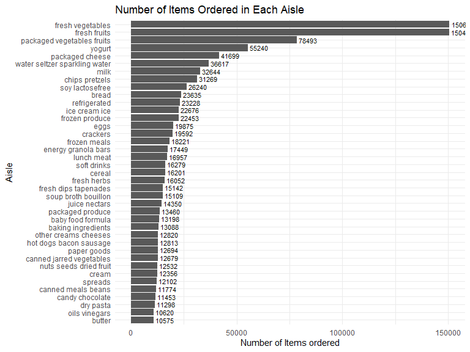

P8105_hw3_zj2358
================
Zhezheng Jin
2023-10-10

## Problem 1

``` r
library(p8105.datasets)
library(tidyverse)
library(knitr)
data("instacart")
```

Description of the dataset:

The dataset `instacart` has 1384617 observations and 15 variables.
Variables in the dataset include order_id, product_id,
add_to_cart_order, reordered, user_id, eval_set, order_number,
order_dow, order_hour_of_day, days_since_prior_order, product_name,
aisle_id, department_id, aisle, department. Some key variables include
unique order identifiers (`order_id`, e.g., 13749), the sequence
products are added to the cart (`add_to_cart_order`, e.g., 2 for the
second item), indicators for product reorders (`reordered`, e.g., 0 for
previously ordered), the day an order was placed (`order_dow`, e.g., 2
for Tuesday), and specific product names (`product_name`, e.g., Clean
Linen Candle).

How many aisles are there, and which aisles are the most items ordered
from?

``` r
num_aisles <- n_distinct(instacart$aisle)

top_aisle <- instacart %>%
  group_by(aisle) %>%
  summarise(count = n()) %>%
  arrange(-count) %>%
  slice(1) %>%
  pull(aisle) 
```

There are 134 unique aisles, and the most items are ordered from the
fresh vegetables.

Make a plot that shows the number of items ordered in each aisle,
limiting this to aisles with more than 10000 items ordered. Arrange
aisles sensibly, and organize your plot so others can read it.

``` r
aisle_plot <- instacart %>%
  group_by(aisle) %>%
  summarise(item_count = n()) %>%
  filter(item_count > 10000) %>%
  arrange(-item_count)
ggplot(aisle_plot, aes(x = reorder(aisle, item_count), y = item_count)) +
  geom_bar(stat="identity") +
  coord_flip() + 
  labs(title = "Number of Items Ordered in Each Aisle",
       x = "Aisle",
       y = "Number of Items ordered") +
  theme_minimal()
```

<!-- -->

Make a table showing the three most popular items in each of the aisles
“baking ingredients”, “dog food care”, and “packaged vegetables fruits”.
Include the number of times each item is ordered in your table.

``` r
popular_items <- instacart %>%
  filter(aisle %in% c("baking ingredients", "dog food care", "packaged vegetables fruits")) %>%
  group_by(aisle, product_name) %>%
  summarise(item_count = n(), .groups = "drop") %>%
  arrange(aisle, -item_count) %>%
  group_by(aisle) %>%
  slice_head(n = 3)

knitr::kable(popular_items,caption = "Top 3 Items in Selected Aisles", align = c('l', 'l', 'r'))
```

| aisle                      | product_name                                  | item_count |
|:---------------------------|:----------------------------------------------|-----------:|
| baking ingredients         | Light Brown Sugar                             |        499 |
| baking ingredients         | Pure Baking Soda                              |        387 |
| baking ingredients         | Cane Sugar                                    |        336 |
| dog food care              | Snack Sticks Chicken & Rice Recipe Dog Treats |         30 |
| dog food care              | Organix Chicken & Brown Rice Recipe           |         28 |
| dog food care              | Small Dog Biscuits                            |         26 |
| packaged vegetables fruits | Organic Baby Spinach                          |       9784 |
| packaged vegetables fruits | Organic Raspberries                           |       5546 |
| packaged vegetables fruits | Organic Blueberries                           |       4966 |

Top 3 Items in Selected Aisles

Make a table showing the mean hour of the day at which Pink Lady Apples
and Coffee Ice Cream are ordered on each day of the week; format this
table for human readers (i.e. produce a 2 x 7 table).

``` r
product_hour <- instacart %>%
  filter(product_name %in% c("Pink Lady Apples", "Coffee Ice Cream")) %>%
  group_by(product_name, order_dow) %>%
  summarise(mean_hour = mean(order_hour_of_day, na.rm = TRUE), .groups = "drop") %>%
  spread(key = order_dow, value = mean_hour) %>%
  select(product_name, `0`, `1`, `2`, `3`, `4`, `5`, `6`) 

knitr::kable(product_hour, caption = "Mean Hour of Order by Product and Day of the Week", digits = 2)
```

| product_name     |     0 |     1 |     2 |     3 |     4 |     5 |     6 |
|:-----------------|------:|------:|------:|------:|------:|------:|------:|
| Coffee Ice Cream | 13.77 | 14.32 | 15.38 | 15.32 | 15.22 | 12.26 | 13.83 |
| Pink Lady Apples | 13.44 | 11.36 | 11.70 | 14.25 | 11.55 | 12.78 | 11.94 |

Mean Hour of Order by Product and Day of the Week
