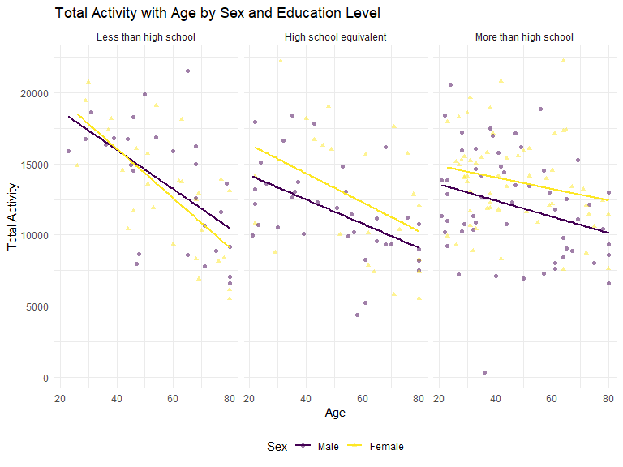
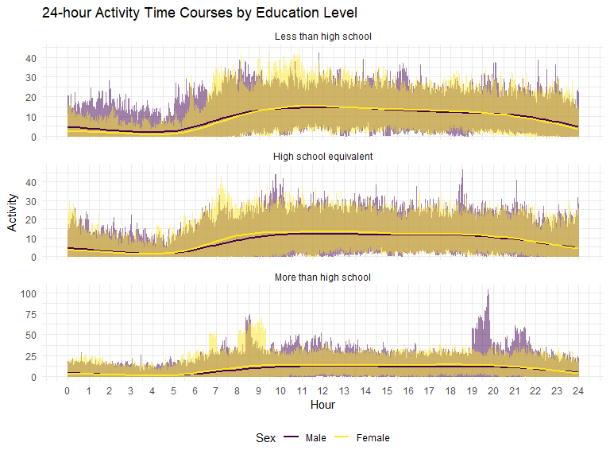

P8105_hw3_zj2358
================
Zhezheng Jin
2023-10-10

## Problem 1

``` r
data("instacart")
```

Description of the dataset:

The dataset `instacart` has 1384617 observations and 15 variables.
Variables in the dataset include order_id, product_id,
add_to_cart_order, reordered, user_id, eval_set, order_number,
order_dow, order_hour_of_day, days_since_prior_order, product_name,
aisle_id, department_id, aisle, department. Some key variables include
unique order identifiers (`order_id`, e.g., 13749), the sequence
products are added to the cart (`add_to_cart_order`, e.g., 2 for the
second item), indicators for product reorders (`reordered`, e.g., 0 for
previously ordered), the day an order was placed (`order_dow`, e.g., 2
for Tuesday), and specific product names (`product_name`, e.g., Clean
Linen Candle).

How many aisles are there, and which aisles are the most items ordered
from?

``` r
num_aisles <- n_distinct(instacart$aisle)

top_aisle <- instacart %>%
  group_by(aisle) %>%
  summarise(count = n()) %>%
  arrange(-count) %>%
  slice(1) %>%
  pull(aisle) 
```

There are 134 unique aisles, and the most items are ordered from the
fresh vegetables.

Make a plot that shows the number of items ordered in each aisle,
limiting this to aisles with more than 10000 items ordered. Arrange
aisles sensibly, and organize your plot so others can read it.

``` r
aisle_plot <- instacart %>%
  group_by(aisle) %>%
  summarise(item_count = n()) %>%
  filter(item_count > 10000) %>%
  arrange(-item_count)

ggplot(aisle_plot, aes(x = reorder(aisle, item_count), y = item_count)) +
  geom_bar(stat="identity") +
  geom_text(aes(label=item_count), position=position_dodge(width=0.9), hjust=-0.1, size=3) +
  coord_flip() + 
  labs(title = "Number of Items Ordered in Each Aisle",
       x = "Aisle",
       y = "Number of Items ordered") 
```


The bar chart above visualizes the number of items ordered in each
aisle, specifically for aisles that have more than 10,000 items ordered.
The aisles are sorted in descending order based on the number of items
ordered, making it easy to identify the most popular aisles. The
`fresh vegetables` aisle is evidently the most popular, with the highest
number of items ordered. This is closely followed by `fresh fruits` and
`packaged vegetables fruits`.Aisles like `oils vinegars`, `dry pasta`,
`canned meals beans`, and `butter` have the lowest order counts among
those displayed, but they still have more than 10,000 orders.

Make a table showing the three most popular items in each of the aisles
“baking ingredients”, “dog food care”, and “packaged vegetables fruits”.
Include the number of times each item is ordered in your table.

``` r
popular_items <- instacart %>%
  filter(aisle %in% c("baking ingredients", "dog food care", "packaged vegetables fruits")) %>%
  group_by(aisle, product_name) %>%
  summarise(item_count = n(), .groups = "drop") %>%
  arrange(aisle, -item_count) %>%
  group_by(aisle) %>%
  slice_head(n = 3)

knitr::kable(popular_items,caption = "Top 3 Items in Selected Aisles", align = c('l', 'l', 'r'))
```

| aisle                      | product_name                                  | item_count |
|:---------------------------|:----------------------------------------------|-----------:|
| baking ingredients         | Light Brown Sugar                             |        499 |
| baking ingredients         | Pure Baking Soda                              |        387 |
| baking ingredients         | Cane Sugar                                    |        336 |
| dog food care              | Snack Sticks Chicken & Rice Recipe Dog Treats |         30 |
| dog food care              | Organix Chicken & Brown Rice Recipe           |         28 |
| dog food care              | Small Dog Biscuits                            |         26 |
| packaged vegetables fruits | Organic Baby Spinach                          |       9784 |
| packaged vegetables fruits | Organic Raspberries                           |       5546 |
| packaged vegetables fruits | Organic Blueberries                           |       4966 |

Top 3 Items in Selected Aisles

From the table above, it’s clear that each aisle has distinct
top-selling items. Here are the details:

Baking Ingredients Aisle:

The most ordered item is Light Brown Sugar with 499 orders. This is
followed by Pure Baking Soda with 387 orders and Cane Sugar with 336
orders.

Dog Food Care Aisle:

The most ordered item in this aisle is Snack Sticks Chicken & Rice
Recipe with 30 orders. Next is Organix Chicken & Brown Rice Recipe with
28 orders and Small Dog Biscuits with 26 orders. It’s worth noting that
the item counts for this aisle are notably lower than the other two
aisles in the table.

Packaged Vegetables Fruits Aisle:

Dominating this category is Organic Baby Spinach with a significant
9,784 orders. Following this are Organic Raspberries with 5,546 orders
and Organic Blueberries with 4,966 orders. All three items in this
category have substantial order counts, indicating their popularity
among shoppers.

Make a table showing the mean hour of the day at which Pink Lady Apples
and Coffee Ice Cream are ordered on each day of the week.

``` r
product_hour <- instacart %>%
  filter(product_name %in% c("Pink Lady Apples", "Coffee Ice Cream")) %>%
  group_by(product_name, order_dow) %>%
  summarise(mean_hour = mean(order_hour_of_day, na.rm = TRUE), .groups = "drop") %>%
  mutate(order_dow = case_when(
    order_dow == 0 ~ "Monday",
    order_dow == 1 ~ "Tuesday",
    order_dow == 2 ~ "Wednesday",
    order_dow == 3 ~ "Thursday",
    order_dow == 4 ~ "Friday",
    order_dow == 5 ~ "Saturday",
    order_dow == 6 ~ "Sunday"
  )) %>%
  spread(key = order_dow, value = mean_hour) %>%
  select(product_name, "Monday", "Tuesday", "Wednesday", "Thursday", "Friday", "Saturday", "Sunday") 

knitr::kable(product_hour, caption = "Mean Hour of Order by Product and Day of the Week", digits = 2)
```

| product_name     | Monday | Tuesday | Wednesday | Thursday | Friday | Saturday | Sunday |
|:-----------------|-------:|--------:|----------:|---------:|-------:|---------:|-------:|
| Coffee Ice Cream |  13.77 |   14.32 |     15.38 |    15.32 |  15.22 |    12.26 |  13.83 |
| Pink Lady Apples |  13.44 |   11.36 |     11.70 |    14.25 |  11.55 |    12.78 |  11.94 |

Mean Hour of Order by Product and Day of the Week

The table illustrates the average hour of the day when “Coffee Ice
Cream” and “Pink Lady Apples” are typically ordered throughout the week.
For “Coffee Ice Cream,” the mean ordering time revolves around the early
to mid-afternoon across all days. The average order time starts at
around 1:45 PM on Monday and reaches its latest around 3:30 PM on
Thursday. In comparison, “Pink Lady Apples” consistently show an average
ordering time during the early afternoon across the entire week. The
time starts at about 11:30 AM on Tuesday and fluctuates slightly but
stays around the early to mid-afternoon range for the rest of the days.

## Problem 2

``` r
data("brfss_smart2010")
```

Data cleaning

``` r
colnames(brfss_smart2010)
```

    ##  [1] "Year"                       "Locationabbr"              
    ##  [3] "Locationdesc"               "Class"                     
    ##  [5] "Topic"                      "Question"                  
    ##  [7] "Response"                   "Sample_Size"               
    ##  [9] "Data_value"                 "Confidence_limit_Low"      
    ## [11] "Confidence_limit_High"      "Display_order"             
    ## [13] "Data_value_unit"            "Data_value_type"           
    ## [15] "Data_Value_Footnote_Symbol" "Data_Value_Footnote"       
    ## [17] "DataSource"                 "ClassId"                   
    ## [19] "TopicId"                    "LocationID"                
    ## [21] "QuestionID"                 "RESPID"                    
    ## [23] "GeoLocation"

``` r
brfss_smart2010 <- brfss_smart2010 %>%
  rename(
    location_abbr = Locationabbr,
    location_desc = Locationdesc,
    class_id = ClassId,
    data_source = DataSource,
    topic_id = TopicId,
    location_id = LocationID,
    question_id = QuestionID,
    resp_id = RESPID,
    geo_location = GeoLocation
  ) %>%
    janitor::clean_names() %>%
  filter(topic == "Overall Health",
         response %in% c("Excellent", "Very good", "Good", "Fair", "Poor")) %>%
  mutate(response = factor(response, 
                           levels = c("Poor", "Fair", "Good", "Very good", "Excellent"),
                           ordered = TRUE))
```

In 2002, which states were observed at 7 or more locations? What about
in 2010?

``` r
states_with_7_or_more_locations <- brfss_smart2010 %>%
  filter(year %in% c(2002, 2010)) %>%
  group_by(year, location_abbr) %>%
  summarise(num_entries = n_distinct(location_desc)) %>%
  filter(num_entries >= 7)
```

    ## `summarise()` has grouped output by 'year'. You can override using the
    ## `.groups` argument.

``` r
states_2002 <- states_with_7_or_more_locations %>%
  filter(year == 2002)  %>%
  pull(location_abbr)

states_2010 <- states_with_7_or_more_locations %>%
  filter(year == 2010) %>%
  pull(location_abbr)
```

In 2002, states observed at 7 or more locations were CT, FL, MA, NC, NJ,
PA. In 2010, states observed at 7 or more locations were CA, CO, FL, MA,
MD, NC, NE, NJ, NY, OH, PA, SC, TX, WA.

Construct a dataset that is limited to Excellent responses, and
contains, year, state, and a variable that averages the data_value
across locations within a state.

``` r
excellent_responses <- brfss_smart2010 %>%
  filter(response == "Excellent") %>%
  group_by(year, location_abbr) %>%
  summarise(avg_data_value = round(mean(data_value, na.rm = TRUE),2))
```

    ## `summarise()` has grouped output by 'year'. You can override using the
    ## `.groups` argument.

Make a “spaghetti” plot of this average value over time within a state

``` r
ggplot(excellent_responses, aes(x = year, y = avg_data_value, group = location_abbr)) +
  geom_line(aes(color = location_abbr), alpha = 0.7) +
  labs(title = "Average value trends for each state",
       y = "Average Data Value") +
  theme_minimal()
```


From the Visualization:

The plot depicts the trends of “Excellent” responses over time, averaged
across locations within each state. There’s a noticeable variance in the
average values of these “Excellent” responses across states over the
years. The dense overlapping of lines around the 20-25 mark suggests
that a significant number of states had their “Excellent” responses
average in this range during various years.

Make a two-panel plot showing, for the years 2006, and 2010,
distribution of data_value for responses (“Poor” to “Excellent”) among
locations in NY State.

``` r
plot_2006=
  brfss_smart2010 |>
  filter(location_abbr=="NY",year==2006)|>
  ggplot(aes(x =location_desc , y = data_value,fill=response)) + 
  geom_bar(position="dodge",stat="identity") +  
  labs(title = "Distribution of data_value in NY State in 2006") + 
  theme(plot.title = element_text(size = 10), axis.text.x = element_text(angle = 20, hjust = 1),legend.position = "none") 

plot_2010=
  brfss_smart2010 |>
  filter(location_abbr=="NY",year==2010)|>
  ggplot(aes(x =location_desc , y = data_value,fill=response)) + 
  geom_bar(position="dodge",stat="identity") +  
  labs(title = "Distribution of data_value in NY State in 2010") +
  theme(plot.title = element_text(size = 10), axis.text.x = element_text(angle = 20, hjust = 1))

plot_2006 + plot_2010
```


From the Visualization:

The plot displays the health perceptions of residents across various New
York counties for 2006 and 2010. While there is variation among
counties, the overall distribution appears somewhat consistent between
the two years. While many counties exhibit bars of similar heights
between the two years (e.g., Kings County, Queens County), some show
noticeable changes. For instance, the “Very good” category appears to
decrease in some counties from 2006 to 2010, while others see an
increase.

## Problem 3

Load and clean the datasets

``` r
nhanes_accel <- read_csv("nhanes_accel.csv")  %>%
  janitor::clean_names()
```

    ## Rows: 250 Columns: 1441
    ## ── Column specification ────────────────────────────────────────────────────────
    ## Delimiter: ","
    ## dbl (1441): SEQN, min1, min2, min3, min4, min5, min6, min7, min8, min9, min1...
    ## 
    ## ℹ Use `spec()` to retrieve the full column specification for this data.
    ## ℹ Specify the column types or set `show_col_types = FALSE` to quiet this message.

``` r
nhanes_covar <- read_csv("nhanes_covar.csv") %>%
  janitor::clean_names()
```

    ## New names:
    ## Rows: 254 Columns: 5
    ## ── Column specification
    ## ──────────────────────────────────────────────────────── Delimiter: "," chr
    ## (5): ...1, 1 = male, ...3, ...4, 1 = Less than high school
    ## ℹ Use `spec()` to retrieve the full column specification for this data. ℹ
    ## Specify the column types or set `show_col_types = FALSE` to quiet this message.
    ## • `` -> `...1`
    ## • `` -> `...3`
    ## • `` -> `...4`

Tidy the data

``` r
nhanes_covar <- nhanes_covar[-c(1:4),] 
colnames(nhanes_covar) <- c("seqn", "sex", "age", "bmi", "education")
nhanes_covar$seqn <- as.integer(nhanes_covar$seqn)
nhanes_covar$age <- as.numeric(nhanes_covar$age)
nhanes_covar$bmi <- as.numeric(nhanes_covar$bmi)

nhanes_accel$seqn <- as.integer(nhanes_accel$seqn)
```

Filter the data

``` r
nhanes_covar <- nhanes_covar %>% 
  filter(age >= 21, !is.na(sex), !is.na(age), !is.na(bmi), !is.na(education))
```

Merge

``` r
nhanes <- inner_join(nhanes_covar, nhanes_accel, by = "seqn")
```

Encode data

``` r
nhanes$sex <- factor(nhanes$sex, levels = c("1", "2"), 
                          labels = c("Male", "Female"))

nhanes$education <- factor(nhanes$education, 
                               levels = c("1", "2", "3"), 
                               labels = c("Less than high school", 
                                          "High school equivalent", 
                                          "More than high school"))
```

Produce a Reader-Friendly Table

``` r
education_table <- table(nhanes$sex, nhanes$education)
knitr::kable(education_table, 
             caption = "Number of Men and Women in Each Education Category")
```

|        | Less than high school | High school equivalent | More than high school |
|:-------|----------------------:|-----------------------:|----------------------:|
| Male   |                    27 |                     35 |                    56 |
| Female |                    28 |                     23 |                    59 |

Number of Men and Women in Each Education Category

From the Table:

The dataset contains a fairly balanced distribution of men and women
across different education levels, with no extreme disparities in
numbers. More males (35) have an education equivalent to high school
compared to females (23). In contrast, for education levels beyond high
school, females (59) outnumber males (56).

Visualization of the age distributions

``` r
ggplot(nhanes, aes(x = education, y = age, fill = sex)) +
  geom_boxplot() +
  labs(title = "Age Distribution by Sex and Education",
       x = "Education Level",
       y = "Age",
       fill = "Sex") +
  theme_minimal()
```


From the Visualization:

The people from group with a education level more than high school are
the youngest on average, compared to the people from group with a
education level less than high school, who are the oldest on average.
The group with a education level high school equivalent has a wider age
range. The group with the largest gap in age distribution between male
and female is the group with a education level of high school
equivalent.

Create a total activity variable for each participant & Plotting

``` r
nhanes$total_activity <- rowSums(nhanes[, grep("^min", names(nhanes))])
ggplot(nhanes, aes(x = age, y = total_activity, color = sex)) +
  geom_point(aes(shape = sex), alpha = 0.5) + 
  geom_smooth(method = "lm", se = FALSE) + 
  facet_wrap(~ education) + 
  labs(title = "Total Activity with Age by Sex and Education Level",
       x = "Age",
       y = "Total Activity",
       color = "Sex",
       shape = "Sex") 
```

    ## `geom_smooth()` using formula = 'y ~ x'



From the Visualization:

The trend consistent across education levels. For all education levels,
there is a negative correlation between the total activity and age,
which means the total activity decrease with age, and the trend is the
same for men and women. The group with the education level less than
high school shows more total activity than the other two groups for both
male and female. For groups of high school equivalent and more than high
school, women always have more total activity than men at the same age.

Make a three-panel plot

``` r
nhanes_new <-nhanes %>%
  pivot_longer(cols = starts_with("min"), 
               names_to = "minute", 
               values_to = "activity") %>%
  mutate(minute = as.integer(gsub("min", "", minute)))

ggplot(nhanes_new, aes(x = minute, y = activity, color = sex)) +
  geom_line(alpha = 0.5) +
  geom_smooth(se = FALSE) +
  facet_wrap(~ education, scales = "free_y", ncol = 1) +
  scale_x_continuous(name = "Hour", breaks = seq(0, 1440, 60), labels = 0:24) +
  labs(title = "24-hour Activity Time Courses by Education Level",
       y = "Activity",
       color = "Sex") 
```

    ## `geom_smooth()` using method = 'gam' and formula = 'y ~ s(x, bs = "cs")'



From the Visualization, we can conclude that:

1.  There’s nearly no gender difference in activity patterns across
    three education groups from the smooth trends.

2.  For all three groups, they are more active from about 9 am to 8 pm.

3.  The average daily activity time of the three groups is ranked as:
    less than high school \> high school equivalent \> more than high
    school.

4.  The group with more than high school education shows more consistent
    activity with less peaks and troughs.
